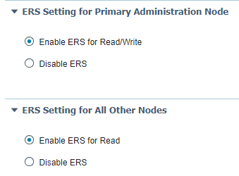
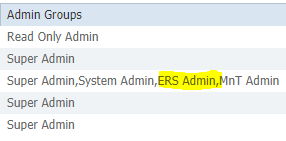
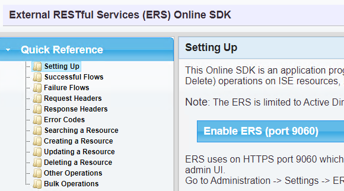
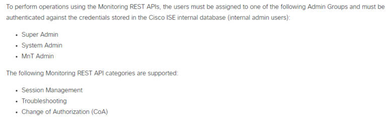

# Magic Carpet on ISE 

## Enable ERS




ISE RBAC requires ERS permissions be set





## Enable MnT


MnT Permissions



## Update your testbed

```yaml

devices:
    ISE:
      alias: 'ISE'
      type: 'ISE'
      os: 'ISE'
      platform: ISE
      credentials:
        default:
          username: {{ your ISE API username }}
          password: {{ your ISE API password }}
      connections:
          ip: "{{ your ISE IP }}"
```

### Run Magic Carpet on ISE 

```console
pyats run job ISE_magic_carpet_job.py
```

First - you will get onto the Magic Carpet


Next - Genie Magic


We head into the cloud !


All of the CLI and API JSON is magically transformed


Finally - We escape the Cave of Wonders with the network data


```bash
cd Cave_of_Wonders

ls 
```

To view the pyATS log in a web browser Locally

```bash
pyats logs view
```

To view the pyATS log in a web browser remotely

```bash
pyats logs view --host 0.0.0.0 --port 8080 -v
```


