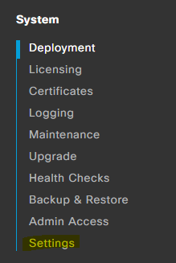
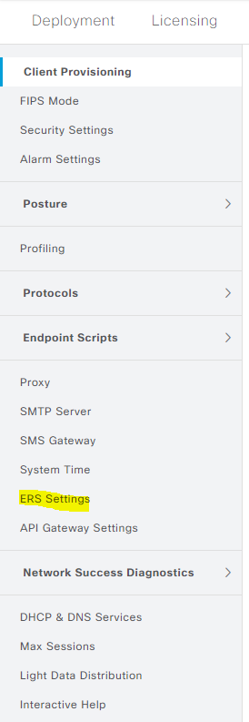
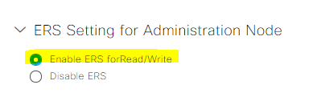

# Magic Carpet on ISE 

## Enable ERS








### Run Magic Carpet on ISE 

```console
pyats run job DevNet_Sandbox_ISE_magic_carpet_job.py
```

First - you will get onto the Magic Carpet


Next - Genie Magic


We head into the cloud !


All of the CLI and API JSON is magically transformed


Finally - We escape the Cave of Wonders with the network data


```bash
cd Cave_of_Wonders/Cisco/DevNet_Sandbox/ISE

ls 
```

To view the pyATS log in a web browser Locally

```bash
pyats logs view
```

To view the pyATS log in a web browser remotely

```bash
pyats logs view --host 0.0.0.0 --port 8080 -v
```


